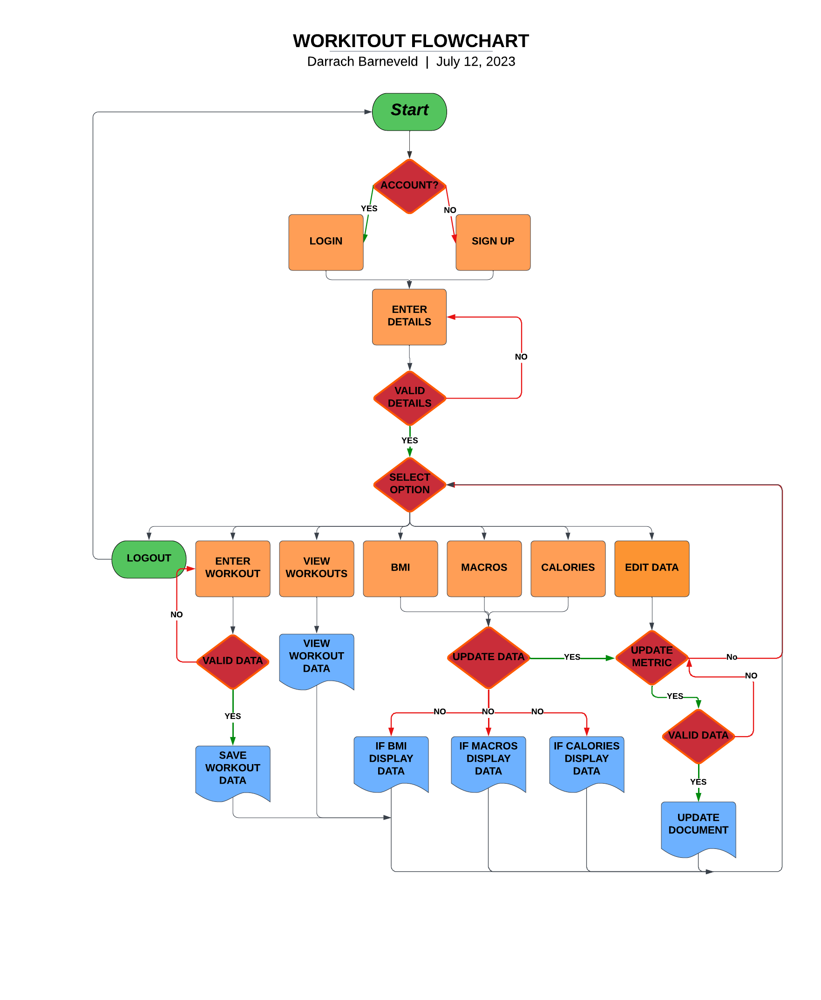
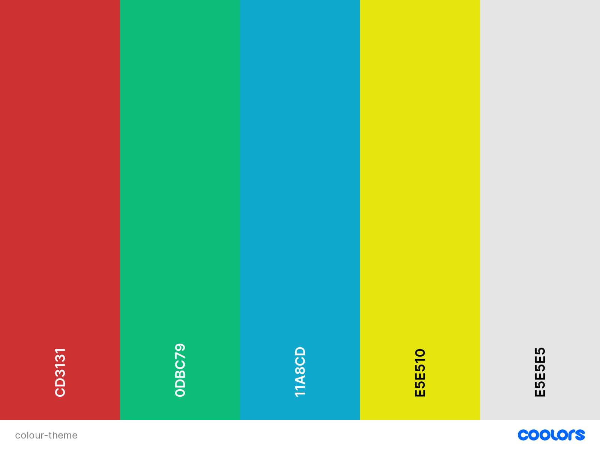
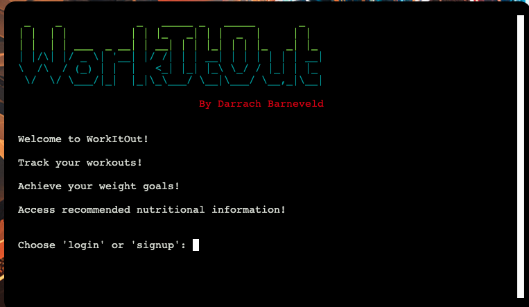
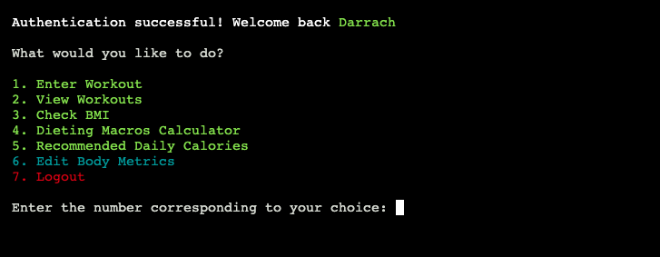
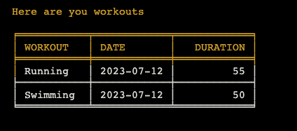
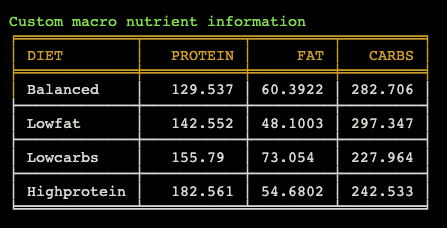
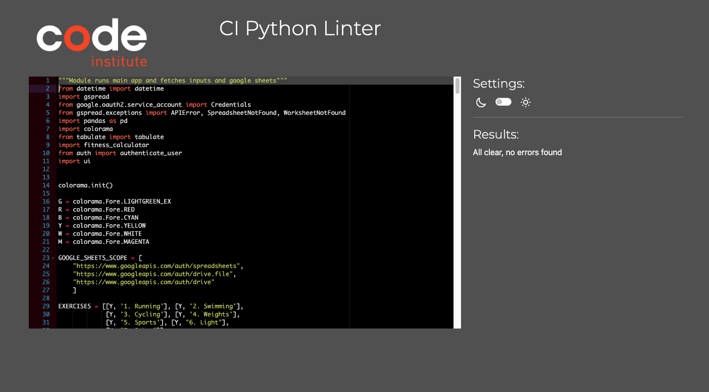
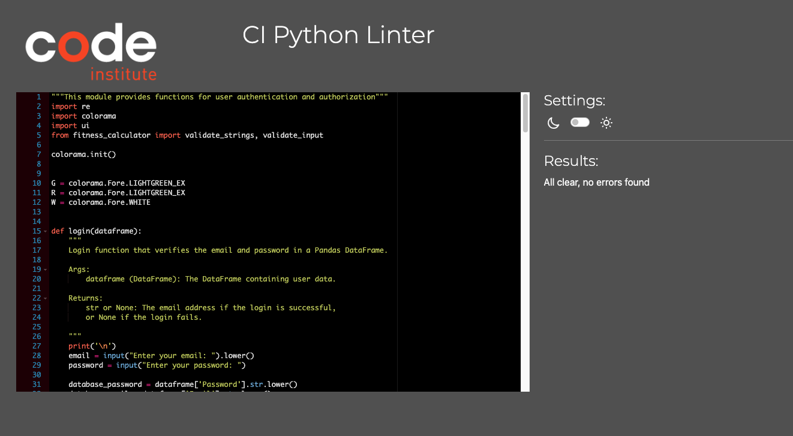
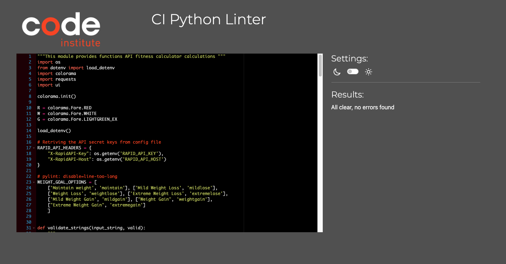
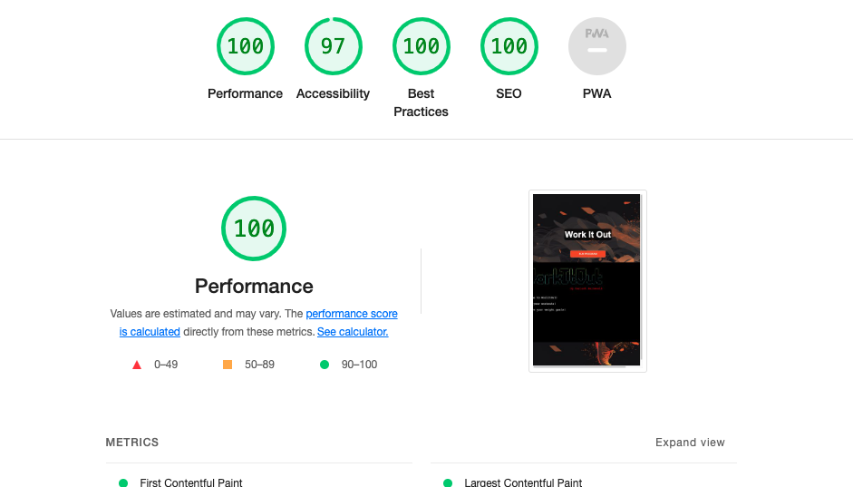

# WorkItOut

(Developer: Darrach Barneveld)

[WorkItOut Live Page](https://work-it-out-066ec18b52ea.herokuapp.com/)

WorkItOut is an all-in-one fitness app that allows you to enter and track your workouts effortlessly. It also provides personalized nutritional information based on your diet goals, including your BMI, daily calorie intake, and recommended macros. Stay on top of your fitness journey with WorkItOut's intuitive features and achieve a healthier lifestyle with ease.

## Table of Contents

1. [Project Goals](#project-goals)
   1. [Business Goals](#business-goals)
   2. [User Goals](#user-goals)
2. [UX](#UX)
   1. [Target Audience](#target-audience)
   2. [User Requirements and Expectations](#user-requirements-and-expectations)
   3. [User Stories](#user-stories)
   4. [Flow Chart](#flow-chart)
3. [Design](#design)
   1. [Colour Theme](#colour-theme)
   2. [Banner](#banner)
   3. [Options Menu](#options-menu)
   4. [Data Formatting](#data-formatting)
4. [Features](#features)
   1. [Current Features](#current-features)
   2. [Potential Features](#potential-features)
5. [Testing](#testing)
   1. [Website/Business Owner Stories](#websitebusiness-owner-stories)
   2. [New Users Stories](#new-users-stories)
   3. [Existing Users Stories](#existing-users-stories)
   4. [Validation Python Code](#validation-python-code)
   5. [Deployed Site](#deployed-site)
6. [Bugs](#Bugs)
7. [Deployment](#deployment)
   1. [Deploying on Heroku](#deploying-on-heroku)
   2. [Fork and Clone the Repository](#fork-the-repository)
8. [Credits](#credits)
   1. [Images](#images)
   2. [Favicon](#favicon)
   3. [Code](#code)
9. [Technologies Used](#credits)
   1. [Modules Imported](#modules-imported)
10. [Acknowledgements](#acknowledgements)

## Project Goals
The primary goal of WorkItOut is to provide an concise applicaion that allows users to easily enter and track their workouts. It also helps users develop a heavily life style by using a comprehensive nutrition database to offer customized nutritional information based on user and thier goals.

### Business Goals
1. The primary business goal for the WorkItOut app is to attract a significant number of users who are interested in fitness and nutrition.
2. Build a strong brand presence: Develop a strong brand identity for WorkItOut through consistent branding, engaging content, and positive user experiences.
3. Gather user data for research and insights: Leverage the anonymized and aggregated user data to conduct research and gain valuable insights into fitness trends, user preferences, and behavior patterns.
4. Expand the app's functionality and features: Continuously enhance and expand the app's capabilities to cater to the evolving needs of users.

### User Goals
1. Users want to set specific fitness goals, such as weight loss, muscle gain, or improved endurance, and track their progress over time. 
2. Users expect the app to have an intuitive and user-friendly interface that is easy to navigate and understand.
3. Users want the ability to track their workout performance, frequency and durations.
4. Users expect the ability to track dietary goals and get a better understanding of recommended nutritional information that is customised based on their current profile.
5. Users expect the app to continually evolve and improve based on user feedback and emerging fitness trends

[Back to Table of Contents](#table-of-contents)

## UX

### Target Audience
1. Individuals who are passionate about fitness, exercise, and maintaining an active lifestyle. 
2. People who prioritize their health and well-being.
3. Individuals who aim to lose weight, build muscle, or transform their bodies.

### User Requirements and Expectations
1. Users expect an intuitive and easy-to-navigate interface that allows them to quickly access and utilize the app's features.
2. Users require the ability to enter and track their workouts
3. Users require a log or history of their workouts for reference and progress tracking
4. Users expect the app to offer tools for tracking their daily food intake, including calories, macronutrients, and other nutritional information.

### User Stories

#### Website/Business Owner:
1. As a website/business owner, I want to attract a large user base to my fitness app website. 
2. As a website/business owner, I want to continuously improve the app based on user feedback.
3. As a website/business owner, I want to build a strong brand presence for the app. 

#### New Users:
1. As a new user, I want to easily understand the purpose and benefits of the fitness app.
2. As a new user, I want a simple and intuitive sign-up process.
3. As a new user, I want to track my progress easily. I expect the website to have a user-friendly interface that allows me to log my workouts., track my nutrition, and view my progress in a visually appealing and understandable format.
4. As a new user, I want to track my nutrition easily. I wish to have custom breakdowns that are tailored to my fitness goals displayed in an understandable format.

#### Existing Users:
1. As an existing user, I want the option to easily log into my account.
2. As an existing user, I want to track my ongoing progress. 
3. As an existing user, I want the app to continuously improve based on user feedback.
4. As an existing user, I want to be able to easily gain insight to my nutrition plan based on my current metrics.

### Flow Chart
The Flowchart created with [LucidChart](https://www.lucidchart.com/pages/). This is a visual representation of the user flow through the application.

[Back to Table of Contents](#table-of-contents)

## Design

### Colour Theme

As this was a terminal-based project colours were crafted using [Colourma](https://pypi.org/project/colorama/) which that provided a palette of colors to be used in the text. The website incorporated prominent colors such as red, blue, yellow, green, and white to create an engaging and visually appealing interface.

The general layout was as follows: 

1. Red - Error Messages
2. Green - Success Messages
3. BLue - Styling UI
4. Yellow - Command Messages
5. White - Default Text

### Banner

The intro hero banner was created using Ascii. The tool [Patrojk](https://patorjk.com/software/taag/#p=display&f=Graffiti&t=Type%20Something%20) was used to convert text to a font in Ascii format so as to be printed to the terminal.

### Options Menu

The main menu was clearly labelled with 7 different options to choose from. Users can easily enter in their choice by matching the corresponding number.

### Data Formatting

To present data in a clear and organized manner, the website utilized the [Tabulate](https://pypi.org/project/tabulate/) library, which allowed for easy formatting and creation of tables that were easy to read and comprehend. 

The combination of well-chosen colors and structured data tables enhanced the overall user experience and usability of the website.

[Back to Table of Contents](#table-of-contents)

## Features

### Current Features

1. Enter workout details:  Users can input the type of exercise performed and the duration to accurately track their workouts.
2. View all workouts: Users have access to a comprehensive view of their logged workouts, allowing them to review their workout history and monitor their progress.
3. BMI calculator: Calculator that enables users to calculate their Body Mass Index as an indicator of their overall health and fitness level.
4. Recommended calorie intake: Based on users' diet goals (weight loss, maintenance, or muscle gain), the application provides personalized recommendations for daily calorie intake to support their nutrition objectives.
5. Recommended macros: Customized macronutrient ratios (protein, carbohydrates, and fats) based on users' weight, height, age, gender and activity level, helping them optimize their nutrition and meet their fitness goals.
6. Editing User Data: Users can update thier current data at any time for accurate custom calculations. 
7. Users can log out at any time.

### Potential Features
1. Workout plans: Offer pre-designed workout plans tailored to different fitness goals, such as weight loss, muscle gain, or overall fitness. Users can follow these plans for structured and guided training.
2. Customizable meal plans: Provide the option to create personalized meal plans based on dietary preferences, restrictions, and fitness goals. Offer suggestions for balanced meals and portion sizes.
3. Nutritional tracking and logging: Allow users to log their daily food intake, track calories, macronutrients, and micronutrients, and view nutritional breakdowns for meals and snacks.

## Testing

### Website/Business Owner Stories
- I want to test the applications ease of navigation to ensure that users can easily find the information
   1. Users can navigate back to the home page from data tables.
   2. Users are always redirected back to the selection screen when they have finished inputing a workout.
   3. The list of features is clear and presented well.

- I want information to be presented clearly in an easy to understand format
   1. All data is formated onto a table with columns and rows.

- I authentication to be easy and intuitive
   1. Users are prompted whether to login or signup.
   2. Each option has clear step by step instructions.
   3. Any errors are clearly displayed and prompting the user to try again.

- I want to be able to logout of the application to avoid security issues
   1. Users can log out at anytime from the main menu.

### New Users Stories
- I want to immediately understand the application so I can make a quick decision as to whether or not to continue.
   1. The intro page clearly states the purpose of the application and the brand of the product

- I want to be able to quickly navigate around the application and understand its features.
   1. Clear instruction on what options are available
   2. Simple commands to progress through the applications flow.

- I want to be information to be displayed easily with customisable data.
   1. Users can updated current metrics for accurate customisable data
   2. Data is displayed in easy to read tables

- I want the login/signup process to be simple and quick
   1. The login/signup procedure is a simple 3 step process
   2. The steps are broken down with prompts and error handling

### Existing Users Stories

- I want to easily be able to log into my account
   1. Users can easily log into there account with a simple 3 step process

- I want to be able to view my log of workouts
   1. Users can view all thier workouts displayed in an easy to read table

- I want to be able to change my current statistical information
   1. Users can update there current weight, height age and activity level

- I want to be able to change my fitness goals
   1. Users can check different diet plans and weight loss journeys based on new input information

### Validation Python Code

While writing the code in Visual Studio Code I used the linter [PyLance](https://marketplace.visualstudio.com/items?itemName=ms-python.vscode-pylance) to guide me in the best practice of formating and also hints on functional writing.

Code Institute's [Python Linter](https://pep8ci.herokuapp.com/) was used to check PEP8 validation. This was used at the end of the projects completion to catch any remaining errors.

PEP8 Validation: run.py

<ul><li>ASCII art creates linting errors. In order to resolve these errors the UI banner logo will have to be removed detracting from the experience of the application.</li></ul>

PEP Validatation: auth.py

PEP Validatation: fitness_calculator.py

PEP Validatation: ui.py

### Deployed Site

The Deployed Site was testing using Google Lighthouse to ensure performance was ok on the broswer. Markup and CSS validation were used also however there performance was beyond the scope of this project as the Code Institute template was used.

Google Lighthouse Desktop

Google Lighthouse Mobile

[W3C Markup Score](https://validator.w3.org/nu/?doc=https%3A%2F%2Fwork-it-out-066ec18b52ea.herokuapp.com%2F)
[W3C CSS Score](https://jigsaw.w3.org/css-validator/validator?uri=https%3A%2F%2Fwork-it-out-066ec18b52ea.herokuapp.com%2F&profile=css3svg&usermedium=all&warning=1&vextwarning=&lang=en)

[Back to Table of Contents](#table-of-contents)

## Bugs

| **Bug** | **Fix** |
| ------- | ------- |
| Login/Signup validation was not rerunning the input option when a invalid input was entered so vaulty data was stored| Added a while not loop that kept prompting the user for valid information if the validator did not return true|
| Mutable global variables of google sheets and dataframes were at risk of corruption in associated functions| Created all instances of the the variables to be passed as parameters to necessary functions to avoid mutations |
| Image urls not rendering correctly on deployment. Filepaths were not absolute. | Used the github repo url instead of file path names to render the background and favicon images |
| Sensitive API keys were being exposed to the github repo against best practice. | Created a dotenv file to hide sensitive information and used the python-dotenv module to access the information. All config vars were added to heroku |
| Multiple users could use the same email meaning validation was an issue and updating worksheets. | Created a function which check the validitiy of an email and check the current database to see if it was not already registered |
| Sometimes the APIs were down and unable to display information which crashed the application. | Added a try and except block which caught the errors and displayed an error message to the user |
| Pep8 Errors on Ascii art due to invalid escape sequence. | In order to display the ascii art to provide a great UX I ahd to allow for this linting error to occur |

[Back to Table of Contents](#table-of-contents)

## Deployment

Code Institute Python Essentials Template for creating a terminal UI where the python code will generate its output to the user. 

Steps to reproduce:

1. Visit the [Code Institute Essentials Template](https://github.com/Code-Institute-Org/python-essentials-template) and select use this template.
2. Select create a new repository.

### Deploying on Heroku

1. Create a Heroku account. 
2. Sign up with a student account for credits. (optional)
3. Once logged in select create new app.
4. Select an app name and region.
5. Select deployment method as connect to github.
6. Find the repo containing the python code created with the CI template and connect it.
7. Enable automatic deploys and select the main branch
8. In the settings tab select reveal config vars. Input the required hidden variables.
9. For this project a creds.json and RAPID_API_HOST, RAPID_API_KEY were created as config vars.
10. Select nodejs and python as the buildpack.
11. Deploy.

### Fork The Repository

1. Go to the GitHub repository
2. Click on Fork button in the upper right-hand corner
3. Edit the repository name and description if desired
4. Click the green create fork button

### Clone The Repository

1. Go to the GitHub repository
2. Locate the green Code button above the list of files and click it
3. Select if you prefer to clone using HTTPS, SSH, or Github CLI and click the copy button to copy the URL to your clipboard
4. Open Git Bash
5. Change the current working directory to the one where you want the cloned directory
6. Type git clone and paste the URL from the clipboard ($ git clone https://github.com/YOUR-USERNAME/YOUR-REPOSITORY)
7. Press Enter to create your local clone.

### Run The Repository Locally

1. Go to the GitHub repository
2. Locate the green Code button above the list of files and click it
3. From the dropdown menu select download Zip.
4. Download and open the zip file to run in an editor

[Back to Table of Contents](#table-of-contents)

## Credits

### Images

- Background Image [Background Image](https://slidesdocs.com/background/sports-running-dynamic-powerpoint-background_8c2cfd71f0)

### Favicon

- Favicon Barbell Image [Flaticon](https://www.flaticon.com/free-icon/barbell_2936886?term=gym&page=1&position=15&origin=tag&related_id=2936886)

### Code
Credit to [Berat Zorlu](https://github.com/beratzorlu/python-quiz) for the typing animation and colours. By understanding his code I was able to implement a typing and colour scheme to my project. 

Credit to [Berat Zorlu](https://github.com/beratzorlu/python-quiz) for his readme. This readme was used as a template on how correct display bugs and fixes in markup.

Credit to [useriasminna](https://github.com/useriasminna/american_pizza_order_system) for the clearing console commands to give a fresh terminal screen to present user data.

Credit to [Dr Angela Yu](https://www.udemy.com/course/100-days-of-code/) and 100 days of Python for a greater understanding of error handling in python.

Credit to [Pylance](https://marketplace.visualstudio.com/items?itemName=ms-python.vscode-pylance) for helping me to indent and format code, document functions and modules and to follow python best practices.

Credit to [Thomas & Asclepius](https://stackoverflow.com/questions/8022530/how-to-check-for-valid-email-address) for helping create a basic python email validator function.

Credit to [Gspread](https://docs.gspread.org/en/latest/user-guide.html) documentation for a better understanding of gspread methods.

[Back to Table of Contents](#table-of-contents)

## Technologies Used

- [Git](https://git-scm.com/)
- [GitHub](https://github.com/)
- [VS Code](https://code.visualstudio.com/)
- [Favicon.io - favicon generator](https://favicon.io/)
- [Coolors - Theme generator](https://coolors.co/)
- [RapidAPI - Fitness Calcultor](https://rapidapi.com/malaaddincelik/api/fitness-calculator/)
- [Chat-GPT](https://chat.openai.com/)
- [Google Lighthouse](https://developer.chrome.com/docs/lighthouse/overview/)
- [Code Institutes Pep8 Checker](https://pep8ci.herokuapp.com/)
- [W3C Markup Validation Service](https://validator.w3.org/)
- [W3C CSS Validation Service](https://jigsaw.w3.org/css-validator/)
- [Pylance Validator](https://marketplace.visualstudio.com/items?itemName=ms-python.vscode-pylance)
- [Lucid Chart](https://www.lucidchart.com/)
- [Heroku](https://heroku.com/)

### Modules Imported
- [google.oauth2.service_account](https://google-auth.readthedocs.io/en/master/reference/google.oauth2.service_account.html) - Access to credientials in creds.json
- [gspread](https://docs.gspread.org/en/v5.10.0/) - Linking and reading google spreadsheet
- [os](https://docs.python.org/3/library/os.html) - To get access to the operating system
- [time](https://docs.python.org/3/library/time.html) - Allowing sleep delays to terminal UI
- [datetime](https://docs.python.org/3/library/datetime.html) - Formating dates for workouts
- [tabulate](https://pypi.org/project/tabulate/) - Formating data into tables
- [colorma](https://pypi.org/project/colorama/) - Adding colour to the terminal display
- [pandas](https://pandas.pydata.org/docs/) - Easier configuration of data objects from csv
- [re](https://docs.python.org/3/library/re.html) - Allowing reading of regex 
- [sys](https://docs.python.org/3/library/sys.html) - Sleep characters in text animation
- [dotenv](https://pypi.org/project/python-dotenv/) - Hidding and reading config variables

[Back to Table of Contents](#table-of-contents)

## Acknowledgements

Special thanks to all my fellow Code Institute students of April 2023 for their invaluable bug testing contributions. A special shoutout to Shane Donlon, Alan Bushell and my brother, Cuan Barneveld for thier suggestions for improvements. 

I would also like to thank Beret Zorlu in helping me with my Readme format and allowing me to inspect his project on how to best layout certain functions and readme items.

Your efforts have been immensely helpful in improving the application. Thank you all!

[Back to Table of Contents](#table-of-contents)
